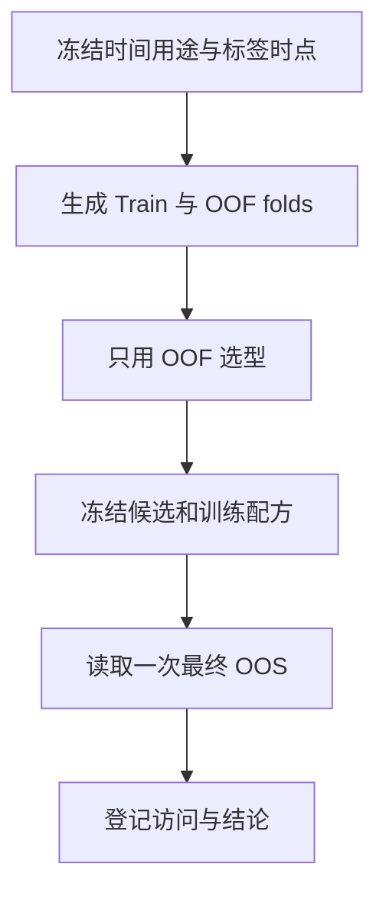
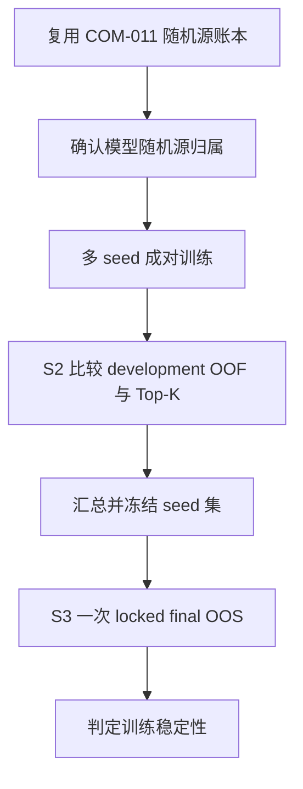
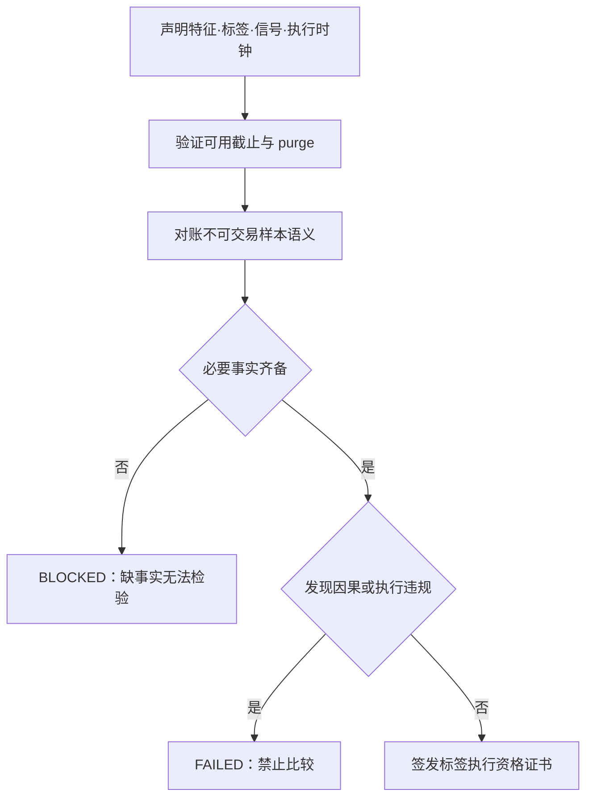
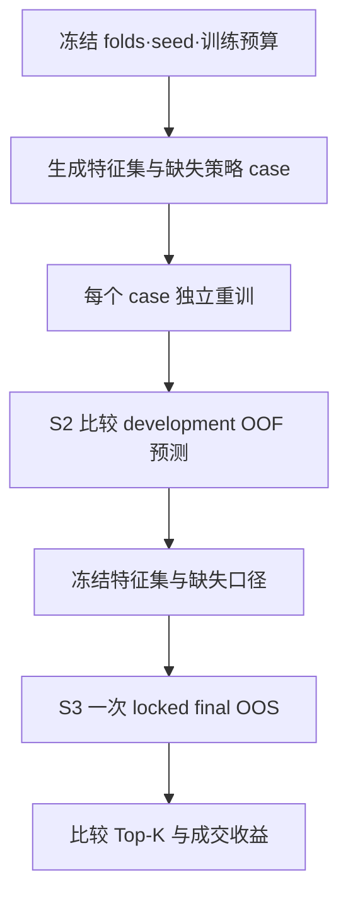
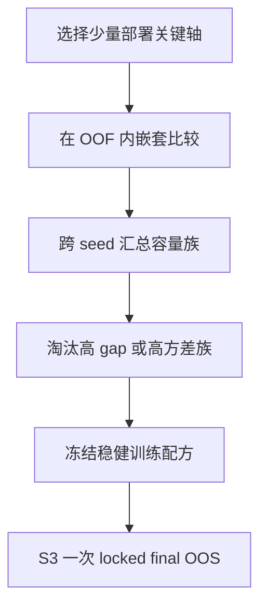
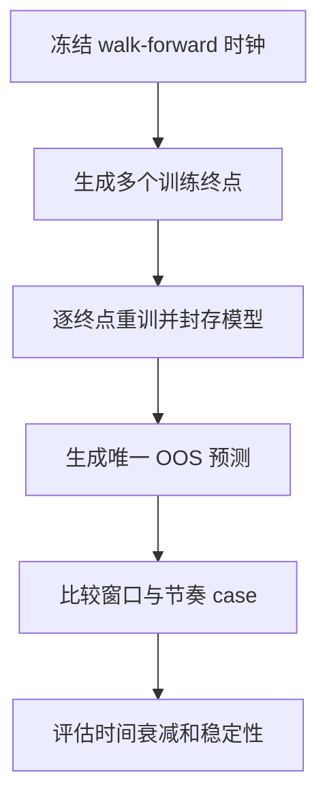
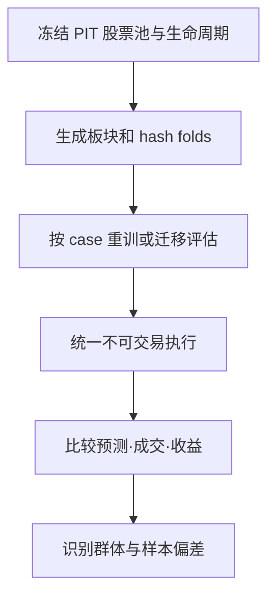
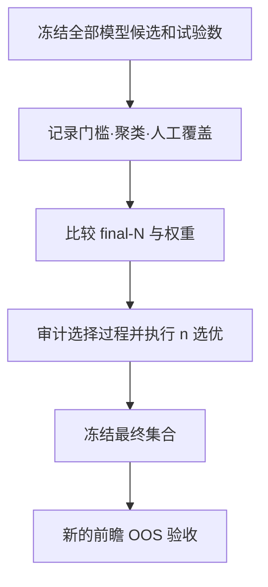
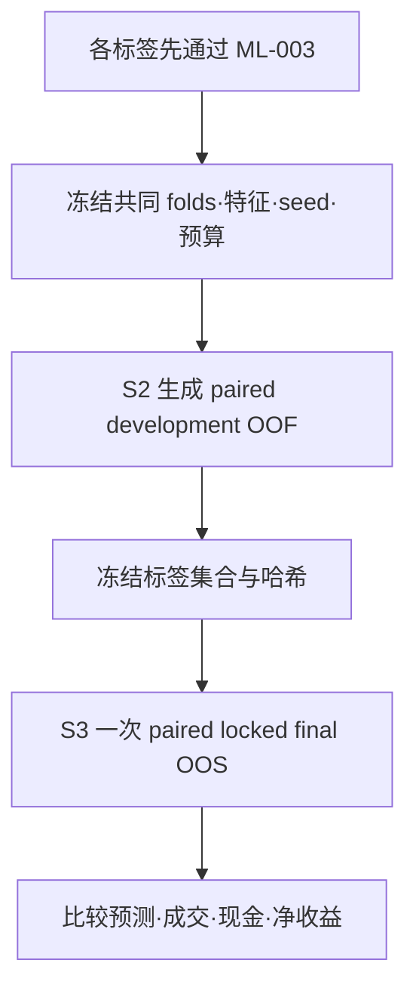
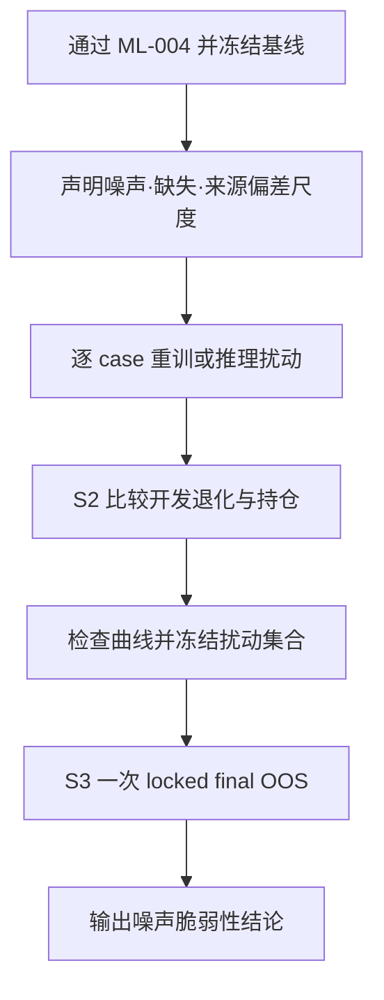

# 机器学习次生算法专用范式

机器学习的特殊性在于：训练数据、标签、fold、随机初始化、特征处理、模型容量和候选筛选都会改变预测。不能只对最终策略参数做传统邻域扫描。

**窗口术语统一**：S2 中出现的 OOF 或 internal walk-forward evaluation 都属于
开发证据，可以参与 seed、特征、标签或配方选择；它们不是 locked final OOS。
只有在候选集合、seed 集、标签集和训练配方全部冻结后，才可在 S3 一次读取
locked final OOS。任何被反向用于选择的“OOS”必须登记为
`consumed_for_selection`，不得继续承担最终确认。下文出现 `OOF/OOS` 时，输出
必须按这两种用途分栏，不得合并成一个未标用途的指标。

## 结论字段与模块角色

始终分别输出以下字段：

- `eligibility_verdict`：只由 `ML-001` 与 `ML-003` 决定。使用 `PASSED`、`FAILED`、`BLOCKED` 或 `INCONCLUSIVE`。
- `overfitting_verdict`：汇总其余适用模块的泛化、稳健性和选择偏差证据。没有预注册阈值或必要证据时必须为 `INCONCLUSIVE`。
- `selection_record`：登记 S2 中选择的 seed、特征、配方、窗口、股票池和标签，以及选择证据、时间和冻结标识。

按以下优先级聚合 verdict：

1. 发现未来信息、OOF 训练污染、locked final OOS 后选择等结构性违规时直接 `FAILED`，不需要数值阈值。
2. 没有结构性违规，但必要数据或依赖不可访问、导致检验无法执行时为 `BLOCKED`。
3. 检验已执行，但缺少预注册阈值、样本覆盖不足或统计证据无法支持方向性结论时为 `INCONCLUSIVE`。
4. 只有全部 P0 门禁及所有适用且预注册的过拟合检验均通过时才可为 `PASSED`；`NOT_APPLICABLE` 模块不参与聚合。

门禁通过不等于模型未过拟合。候选筛选本身也不是通过证据；只有完整试验分母、稳定性分布、开发—评估落差和未触碰 final OOS 才能支持结论。不得自行补造阈值。

`selection_record` 必须使用以下结构；未知事实写 `null` 并列入 `missing_facts`，不得省略或猜测：

```yaml
selection_record:
  dimensions:
    seed: {selected_values: [], evidence_role: development, evidence_ids: [], frozen_at: null, artifact_hash: null}
    feature_set: {selected_values: [], evidence_role: development, evidence_ids: [], frozen_at: null, artifact_hash: null}
    training_recipe: {selected_values: [], evidence_role: development, evidence_ids: [], frozen_at: null, artifact_hash: null}
    window: {selected_values: [], evidence_role: development, evidence_ids: [], frozen_at: null, artifact_hash: null}
    universe: {selected_values: [], evidence_role: development, evidence_ids: [], frozen_at: null, artifact_hash: null}
    label: {selected_values: [], evidence_role: development, evidence_ids: [], frozen_at: null, artifact_hash: null}
  post_selection_events: []
  consumed_oos_ids: []
  missing_facts: []
```

## 脚本使用

脚本仅依赖 Python 标准库，既可直接执行，也可导入其中的函数。模型训练、各 case 独立重训和交易回测仍由调用方完成。

- `scripts/audit_temporal_integrity.py`：服务 `ML-001`、`ML-003`、`ML-007`，校验时间因果、fold 归属和 OOS 访问账本。
- `scripts/compute_stability_metrics.py`：服务 `ML-002`、`ML-004`、`ML-007`、`ML-008`、`ML-010`、`ML-011`，计算预测和持仓稳定性指标。
- `scripts/audit_model_selection.py`：服务 `ML-005`、`ML-009`，审计完整 trial 分母、容量族、选择频率和后选择事件。

各脚本以 CSV 为输入、JSON 为输出。先运行 `python3 scripts/<script>.py --help` 查看字段定义；结构性错误必须修复，统计阈值则必须由研究方案预注册。

## ML-001 Train OOF OOS 隔离与访问账本

**检验角色**：证据完整性门禁。它防止 OOS 污染，不直接证明模型未过拟合。

**选择边界**：只允许使用 development OOF/internal walk-forward 选择候选。任何参与选择的 locked final OOS 必须降级为 `consumed_for_selection`。

**核心思路**：训练、OOF 选型、最终 OOS 和前瞻区间按时间与用途隔离，并记录每次 OOS 被谁、为何读取。

**适用范围**：所有训练型信号，`P0`。

**规则**：

- 特征和标签结束时点均不得越过 `fit_as_of`；
- OOF 只由对应 fold 未训练样本产生；
- purge/embargo 与标签持有期一致；
- full-window 模型不能给自身训练期产生“验证预测”；
- OOS 被用于调参、淘汰、人工加回后降级为 diagnostic；
- 没有新的未触碰区间时，不得声称最终确认。



**脚本**：运行 `python3 scripts/audit_temporal_integrity.py --samples temporal_samples.csv --ledger oos_access.csv --output temporal_audit.json`。样本 CSV 必须包含 `sample_id,fold_id,feature_cutoff,decision_at,label_end,fit_as_of,train_end,validation_start,label_horizon,purge,embargo,in_training,prediction_role,prediction_owner`；所有时间字段使用单调递增的交易时点序号。账本 CSV 必须包含 `dataset_id,access_order,purpose,used_for_selection,status`。

**历史依据**：LGBM 三个 expanding OOF folds、primary OOS 2025、extended OOS 2026、OOF-only paired-label runner，以及“prepared_not_armed、不授权 backtest/live”的用途隔离。时间隔离有历史实践；逐次 OOS 访问账本是规范化新增，因此整体历史状态为 `HISTORICAL_PARTIAL`。

## ML-002 多随机种子模型稳定性

**检验角色**：随机性泛化检验。多 seed 结果分布计入过拟合判断；同 seed 独立复现只证明可复现。

**选择边界**：seed 集必须在 S2 冻结，禁止使用 locked final OOS 挑选或删除 seed。

**核心思路**：固定 seed 的确定性只能证明可复现；模型稳定性必须看多个有业务含义的 seed。

**适用范围**：随机初始化、bagging、feature sampling、数据顺序或随机切分模型，`P1`。

**与通用随机范式的边界**：

- `COM-011` 是 `P0`：只登记随机源并验证同 seed 独立重训可复现；
- `COM-014` 只检验候选抽样、随机破局或随机执行等**非模型**业务随机源；
- `ML-002` 专门检验模型训练、模型采样和随机切分；同一随机源不得再由 `COM-014` 重复执行；
- 混合流程共用一份随机源分类账，但分别对非模型随机源和模型随机源出 verdict。

若 `COM-011` 或 `COM-014` 尚不可用，明确记录 `dependency_status=UNAVAILABLE`，不得静默视为已通过。

**两层设计**：

1. 复用 `COM-011` 的同 seed 独立重训证据，不重复计为稳定性结果。
2. 保持 fold 不变，改变模型/采样 seed；若切分本身随机，再单独改变 split seed。

**输出**：S2 先报告 development OOF/internal walk-forward 的中位、IQR、最差
分位、符号保持率、逐日 Top-K Jaccard 和排序相关；冻结 seed 集后，S3 才一次
报告 locked final OOS 与成交后收益。禁止只报告最佳 seed，也禁止用 final OOS
挑 seed。



**脚本**：运行 `python3 scripts/compute_stability_metrics.py --predictions predictions.csv --baseline-case baseline --baseline-seed 1 --top-k 10 --output stability.json`。输入字段为 `date,asset,case_id,seed,score,target`；每个 `case_id + seed` 构成一个预测变体。

**历史依据**：LGBM 固定 seed、deterministic、固定线程和同环境 Top10 逐日一致要求；完整多 seed 结果分布是本仓库新增，不能把历史固定 seed 误报为已通过。

## ML-003 标签信号与执行因果契约

**检验角色**：因果合法性门禁。发现未来信息、时间错位或不可交易语义冲突时，整体证据失去检验资格；通过本项不等于未过拟合。

**选择边界**：任何标签版本进入比较前必须独立通过本契约，不能先按表现筛选再补做资格检查。

**核心思路**：先证明特征截止、标签窗口、信号时点、真实入场/出场、purge 和不可交易样本处理构成一条因果合法链，再允许比较任何标签版本或模型表现。

**适用范围**：预测收益、排名或事件概率的模型，`P0`。

**资格要求**：

- `allowed_feature_cutoff <= decision_at`，标签结束时点不得进入对应训练样本的特征或拟合时点；
- 标签如 `T close → T+2 close` 必须明确它与真实交易 `T+1 open → T+2/T+3 exit` 的关系；
- 标签末端与 retrain date 之间 purge；
- 信号相位、执行价格域、持有期和估值时点唯一；
- 停牌、涨跌停、买不入、延迟买、退市样本在标签生成、训练样本和回测中一致；
- 任一合法标签替代版本必须先独立通过本契约，才能进入 `ML-010` 的敏感性比较。

**输出**：`label_contract_id`、时间轴证明、purge/embargo 证明、不可交易样本对账、违规样本清单，以及拆分后的执行状态与资格结论。



**脚本**：复用 `audit_temporal_integrity.py` 的样本审计结果。脚本验证可机器判定的时点关系；执行价格域、停牌、涨跌停和退市语义仍需在报告中提供人工可审计证据。

**历史依据**：LGBM 因果标签协议、两日标签的相位平移、买不入延迟事件和退市减记语义。多个标签/持有期之间的成对稳定性另由 `ML-010` 负责。

## ML-004 特征集冗余与缺失消融

**检验角色**：特征规格稳健性检验。独立重训后的性能和持仓稳定性计入过拟合判断。

**选择边界**：可以使用 S2 证据选择稳定特征集合，但必须记录完整 case、选择依据和冻结哈希；禁止用 S3 结果回选。

**核心思路**：每个特征集合、冗余处理和缺失策略 case 都重新训练，避免只在固定模型输入端遮蔽特征而误判重要性。

**适用范围**：所有显式或表示型特征模型，`P1`。

**case**：

- full 与去冗余特征集；
- 关键特征族留一/去一；
- complete-case 与模型原生 missing；
- 负 IC 特征的保留/移除；
- 固定 folds、seed、训练预算和标签契约；
- 主动数值噪声、主动缺失注入和来源偏差压力另走 `ML-011`。

**输出**：S2 用 development OOF/internal walk-forward 形成 paired delta、
IC/RankIC、Top-K Jaccard、预测分布、缺失覆盖和稳定特征集合；集合冻结后，
S3 才读取一次 locked final OOS 与成交后收益。



**脚本**：将每个独立重训 case 写入统一预测表，用 `compute_stability_metrics.py` 计算相对基线的 RankIC、Top-K Jaccard、预测分布漂移、缺失覆盖和信号翻转率。

**历史依据**：linear20 full9/dedup8、负 IC 路线冻结、momentum_5/reversal_5 消融、complete-case/native missing 设计。

## ML-005 训练配方与模型容量稳定性

**检验角色**：模型容量过拟合检验。训练—验证 gap、跨 seed 方差和稳定候选频率计入结论。

**选择边界**：分别报告容量族比较结果与最终部署配方；只允许在嵌套 development OOF 内选择部署点。

**核心思路**：机器学习不要求每个高维超参数都形成平坦曲面；应在嵌套 OOF 内比较少量部署关键容量与正则化配方。

**适用范围**：树模型、深度时序模型和其他高维训练器，`P2`。

**优先轴**：

- 树模型：叶子数、叶最小样本、轮数、学习率、采样/正则；
- 时序模型：窗口、隐藏容量、dropout、早停和序列采样；
- 固定总搜索预算，禁止 winner-only 报告；
- 先比较容量族，再在稳健族内选部署点。

**输出**：S2 报告每个容量族的 development OOF/internal walk-forward 分布、
训练—验证 gap、seed 交互、稳定候选频率和资源成本；配方冻结后，S3 单列一次
locked final OOS。



**脚本**：运行 `python3 scripts/audit_model_selection.py --trials trials.csv --output selection_audit.json`。输入字段为 `trial_id,candidate_id,family,status,training_metric,development_metric,evaluation_metric,selected,manual_override,event_order,final_n,selection_evidence_role`。

**历史依据**：LGBM 训练配方被明确冻结，但历史重点是复现而非容量稳定性；本范式是对传统参数邻域方法的 ML 替代。

## ML-007 Walk-forward 窗口与重训节奏稳定性

**检验角色**：时间泛化检验。跨训练终点、历史长度和更新节奏的退化与方差计入过拟合判断。

**选择边界**：窗口、cadence 和 rolling step 只能根据 S2 选择并冻结，不能在模型固定期内偷重训或用 S3 回选。

**核心思路**：跨多个训练终点重新拟合，检验模型对训练时代、历史长度和更新节奏的依赖。

**适用范围**：滚动训练、季度/月度更新，`P1`。

**case**：

- expanding 与 sliding；
- 训练历史长度；
- retrain cadence；
- rolling step；
- purge/embargo；
- 模型固定期；
- overlapping prediction 的归属与去重。

每个 fold 必须由唯一 owner 产生预测；模型不能在固定期内偷重训。



**脚本**：用 `audit_temporal_integrity.py` 检查 prediction owner 和 purge/embargo，用 `compute_stability_metrics.py` 比较各窗口 case 的预测与持仓稳定性。

**历史依据**：约四年/1000 交易日训练、季度首日更新、purge 3 个交易日、下一季度模型固定；长历史 rolling 和执行回测正在搭建，因此历史状态为部分完成而非完整通过。

## ML-008 股票池板块与不可交易样本稳定性

**检验角色**：横截面泛化检验。群体间预测稳定性计入过拟合判断；单纯成交失败只能作为执行限制，不能单独证明模型过拟合。

**选择边界**：股票池与群体规则只能根据 S2 冻结；不得先读取 S3 再排除表现差的板块或历史退市证券。

**核心思路**：训练样本和回测可交易样本采用同一生存、停牌、涨跌停和退市语义，并检验不同标的群体迁移。

**适用范围**：横截面股票模型，`P1`。

**case**：

- 主板、创业板、科创板；
- 市值、流动性和上市年龄；
- full universe 与 deterministic hash folds；
- 留一板块训练/迁移；
- 不可交易标签处理；
- 退市后零值减记与不得提前排除历史买入。

**输出**：各组样本数、标签分布、development OOF/internal walk-forward、
Top-K 重合、成交率和不可交易诊断；群体规则与候选冻结后，S3 才读取 locked
final OOS、现金及退市/停牌贡献。



**脚本**：把板块、规模、流动性或留一群体编码为 `case_id`，用 `compute_stability_metrics.py` 汇总群体间 RankIC、Top-K 重合和预测漂移；成交语义仍由外部逐证券账本证明。

**历史依据**：L1 board/boundary probe、全历史禁止局部股票子集、停牌买不入保留现金、退市后首个后续交易日零值减记和未知缺口 fail-closed。

## ML-009 模型后选优与最终集合敏感性

**检验角色**：选择诱发的过拟合审计。候选筛选不是通过证据；完整试验分母、选择频率、人工覆盖和开发—评估落差才是审计对象。

**选择边界**：所有筛选只能使用 development 证据。任何基于 locked final OOS 的淘汰、加回、final-N 或权重修改均构成违规后选择。

**核心思路**：模型训练完成后仍会发生大量选择：阈值、聚类、final-N、权重、人工加回和策略组合，这一层必须单独审计。

**适用范围**：大规模模型/特征搜索与模型集合，`P1`。

**方法**：

- 保存完整 trial 数和成功/失败分母；
- 可原样保留历史研究中的 PSR/DSR 字段，但它们不是本仓库的内建门禁或推荐算法；
- 若未来启用任何外部选择修正，必须另行登记方法来源、公式、实现版本、输入假设和验证证据；
- 比较 final2/final4/final8、equal/vote/learned weights；
- 使用 COM-013 检验候选选择频率与开发—评估落差；
- 人工加回必须作为新候选选择事件；
- 最终集合只在新的前瞻 OOS 验收。

若 `COM-013` 尚不可用，明确记录 `dependency_status=UNAVAILABLE`；本 Skill 的脚本只提供试验分母、选择事件和 gap 的基础审计，不能冒充完整 COM-013 结论。



**脚本**：使用 `audit_model_selection.py` 保存 attempted/succeeded/failed 分母、候选与容量族频率、final-N 变化、人工覆盖、训练—开发 gap 和开发—评估落差；`selection_evidence_role` 不是 `development` 的选择事件会被标记为违规。

**历史依据**：ETF 轮动的 53 因子、20,000 随机组合、XGBoost 滚动、final2/4/8、2026 反复使用、历史 PSR/DSR 字段和人工加回；LGBM 的 full9/dedup8 双 finalist 与 owner acceptance。历史字段仅作只读来源映射，不自动升级为规范方法。

## ML-010 标签持有期成对敏感性

**检验角色**：标签规格稳健性检验。合法标签之间的成对表现、持仓和执行差异计入过拟合判断。

**选择边界**：允许使用 paired S2 证据选择标签集合，但必须冻结共同 folds、特征、seed、股票池和预算；禁止用 S3 挑标签。

**核心思路**：只在各候选标签都通过 `ML-003` 后，使用共同 folds、特征、seed、股票池和训练预算比较多个业务合法的预测/持有期版本。

**适用范围**：存在两个或以上业务合理标签或持有窗口的训练型策略，`P1`。只有一个合法标签时写 `NOT_APPLICABLE`，但 `ML-003` 仍不可豁免。

**成对要求**：

- 相同 feature set、fold、seed、股票池和训练预算；
- 每个标签分别生成因果合法的 OOF/OOS，禁止共用不匹配的预测；
- 相位平移后的每日开平仓单独登记；
- 使用相同成本、不可交易、延迟成交和退市口径；
- 同时比较统计预测、Top-K 重合、成交率、现金和净收益，不以单一 IC 选胜者。

**输出**：S2 先报告 paired development OOF/internal walk-forward；冻结合法
标签集合后，S3 才一次读取 paired locked final OOS，并报告持有期收益、
Top-K overlap、成交率、现金、成本和开发—评估落差。若 final OOS 被用于选
标签，其状态必须转为 `consumed_for_selection`。



**脚本**：把每个合法标签编码为 `case_id`，用 `compute_stability_metrics.py` 生成成对 IC/RankIC、Top-K overlap、排序相关和预测漂移；成交率、现金、成本和净收益由调用方账本补充。

**历史依据**：`T+1→T+2` 与 `T+1→T+3` paired-label OOF、两日标签相位平移及对应执行讨论。这些历史实践支持本范式为 `HISTORICAL_USED`，但不替代每次新研究的独立 P0 契约。

## ML-011 主动特征噪声与缺失压力

**检验角色**：扰动稳健性检验。预注册扰动下的退化、漂移、持仓翻转和非单调点计入模型脆弱性判断。

**选择边界**：扰动集合和尺度必须在查看 S3 前冻结；不得删除导致结论变差的扰动 case。

**核心思路**：在完成历史特征/缺失口径消融后，对训练或推理特征施加预注册、业务合理的主动噪声、缺失和来源偏差，检查 OOS 与持仓是否平滑退化。

**适用范围**：能够定义合理扰动尺度的显式或表示型特征模型，`P2`；无法定义尺度时为 `INCONCLUSIVE`，不能伪造通过。

**case 设计**：

- 训练噪声与推理噪声分开；
- 主动缺失与真实缺失机制分开；
- 来源偏差只作用于预注册字段和范围；
- 每个训练扰动 case 独立重训，不能只遮蔽固定模型输入；
- 固定 folds、标签、训练预算和非噪声 seed，并登记噪声 seed；
- 同时输出扰动幅度、覆盖率和期望单调关系。

**输出**：S2 的 development OOF/internal walk-forward 退化曲线、预测分布
漂移、Top-K Jaccard、信号翻转、非单调点和最差 case；扰动集合冻结后，S3
才一次读取 locked final OOS 与成交后收益。



**脚本**：按扰动尺度生成有序 `case_id`，用 `compute_stability_metrics.py` 输出预测漂移、Top-K Jaccard、翻转率及最差 case。通过 `--ordered-variants 'baseline::seed=1,noise-low::seed=1,noise-high::seed=1'` 传入预注册顺序，脚本会分别检查 RankIC、Jaccard、排序相关的非递增关系和翻转率的非递减关系，并输出非单调点。

**历史依据**：历史已有 anomaly audit、特征集消融和缺失口径设计，但主动特征噪声/缺失压力曲线没有完整历史结果；本范式为 `NORMALIZED_EXTENSION`。
